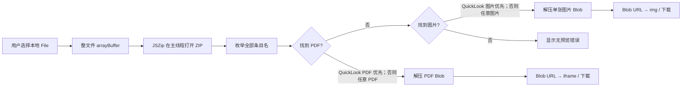

# iWorkViewer.com 竞争产品、技术、隐私与商业分析

> 观察日期：2026-07-15（Asia/Shanghai）
> 目标站点：[https://iworkviewer.com/](https://iworkviewer.com/)
> 研究边界：只使用公开站点、公开前端资源、响应头、公开政策及本机新建的无敏感内容测试文件；未尝试绕过访问控制、读取用户文件或探测非公开接口。
> 结论中的法律部分仅是产品风险识别，不构成法律意见。

## 结论先行

iWorkViewer 不是 iWork 文档解析器，也不是 Pages/Numbers/Keynote 到 PDF、Word、Excel、PowerPoint 的真正转换器。它当前的核心能力是：**在浏览器主线程用 JSZip 打开 ZIP 包，从中取出一个现成 PDF；找不到 PDF 时取出一张图片，再交给浏览器显示或下载。**它不解析 `Index/*.iwa`，不恢复文本、表格、幻灯片或对象结构。

这一做法作为“零上传快速预览”原型很聪明：实现小、无转换服务器成本、隐私卖点清晰，而且配套做了完整的长尾 SEO 与广告变现。但它的公开承诺显著超过实际能力：

- 本机 Pages、Numbers、Keynote 14.5 新建文件均没有嵌入 PDF，只有根目录 `preview.jpg`、`preview-web.jpg`、`preview-micro.jpg`。
- 一个由 Pages 14.5 保存、正文约 220 行、实际为 4 页的测试文档，在站点中只显示一张 `preview image`，并且只提供 **Download preview image**，没有 PDF 和后续页面。
- Keynote 14.5 的新建文件在 `Data/` 下有许多主题素材图片；站点的“任意图片回退”算法会先选中 `Data/` 中第一张 JPG，而不是根目录 `preview.jpg`，存在直接显示错误素材的现实路径。
- “Pages to Word”“Numbers to Excel”“Keynote to PPT”页面实际上仍只提供 PDF/图片预览，然后建议用户去 iCloud 或其他工具完成真正转换。

因此，它更准确的产品定义是：

> **iWork ZIP 内嵌预览/素材提取器 + SEO 内容站，而非全文 viewer 或格式 converter。**

对 OfficeViewer 的核心建议是：**借鉴它的零上传价值表达、即时预览快路径和长尾获客结构，但不要照搬“扫描任意 PDF/图片”、无预算 JSZip 主线程解压、商标命名和输出名大于真实能力的做法。**OfficeViewer 应把内嵌预览作为明确标注的 fallback；真正竞争壁垒仍应是受限解析、完整单位导航、搜索/复制、对象模型、诊断和源映射。

## 1. 证据等级与研究方法

下文使用四种标记：

- **事实**：页面、响应头、公开 bundle 或政策直接可见。
- **运行时实测**：在站点实际选择本机新建测试文件，并观察 UI 与网络请求。
- **技术推断**：由公开代码和行为推导，已经给出推导依据。
- **无法确认**：公开证据不足，不作确定结论。

本轮检查了：

1. 首页、主要转换/查看页、About、Contact、Privacy、Terms、Blog、对比页；
2. `robots.txt`、`sitemap.xml`、`ads.txt`、manifest 和 `security.txt` 常见路径；
3. 首页及工具页的 HTML、Next.js/Turbopack chunk、JSZip 实现和文件处理组件；
4. 首页与静态资源响应头、HTTP/HTTPS 和 apex/`www` 行为；
5. Pages、Numbers、Keynote 14.5 新建空白文件，以及 Pages 14.5 的 4 页测试文档；
6. 选择文件前后的网络请求；
7. Apple 官方商标清单和第三方商标使用指南；
8. Verisign RDAP 域名记录及竞品官方价格页中的个别比较项。

关键一手来源：

- [首页](https://iworkviewer.com/)
- [Pages to PDF](https://iworkviewer.com/pages-to-pdf/)
- [Pages to Word](https://iworkviewer.com/pages-to-word/)
- [Numbers to Excel](https://iworkviewer.com/numbers-to-excel/)
- [Keynote to PPT](https://iworkviewer.com/keynote-to-ppt/)
- [About](https://iworkviewer.com/about/)
- [Privacy Policy](https://iworkviewer.com/privacy-policy/)
- [Terms](https://iworkviewer.com/terms/)
- [robots.txt](https://iworkviewer.com/robots.txt)
- [sitemap.xml](https://iworkviewer.com/sitemap.xml)
- [ads.txt](https://iworkviewer.com/ads.txt)
- [文件处理/JSZip bundle（观察时版本）](https://iworkviewer.com/_next/static/chunks/14qa-h37t7u38.js)
- [首页产品 bundle（观察时版本）](https://iworkviewer.com/_next/static/chunks/26s33804mfil6.js)

## 2. 产品与交互

### 2.1 用户看到的产品

**事实。**首页首屏把价值压缩成四个承诺：任何设备打开、免费、私密、无上传/无注册。入口是一个拖放/选择框，接受 `.pages`、`.numbers`、`.key`、`.keynote`，且允许一次选择多个文件。[首页](https://iworkviewer.com/)

文件处理完成后，每个结果是一张卡片：

- 名称和按文件扩展名推断的类型；
- PDF 时用高度固定为 480px 的 `iframe` 显示，并提供 **Download as PDF**、**Open in new tab**；
- 没有 PDF 而有图片时，用 `img` 显示，并提供 **Download preview image**；
- 没有可用 PDF/图片时显示错误提示；
- 多文件按顺序逐个处理，新一批结果插入旧结果之前。

### 2.2 实际支持的功能

| 能力 | 实际状态 | 证据与限制 |
| --- | --- | --- |
| `.pages/.numbers/.key/.keynote` 单文件 | 条件支持 | 必须是 JSZip 能读取的 ZIP，且含可被扫描命中的 PDF/JPG/JPEG/PNG |
| 多文件 | 支持 | `multiple` 文件输入，主线程顺序处理 |
| PDF 查看/下载 | 条件支持 | 只提取包中已存在的 PDF；不生成 PDF |
| 图片预览/下载 | 支持回退 | 只显示一张被选中的图片；可能不是文档预览 |
| Word/Excel/PPT 输出 | 不支持 | 对应 SEO 页面明确承认不直接产生 DOCX/XLSX/PPTX |
| 文本搜索/复制 | 应用层不支持 | PDF 内嵌浏览器查看器可能自带搜索；图片没有文本层 |
| 页/幻灯片导航、sheet/table 导航 | 不支持 | 没有 iWork 对象解析或单位模型 |
| 编辑、公式、动画、备注 | 不支持 | 不读取 IWA 语义 |
| iWork package 目录 | 不支持 | 输入是普通 `File`，没有目录选择/文件树入口 |
| 密码文件 | 不支持 | JSZip 路径没有 iWork 解密能力 |
| 离线复用/PWA | 未发现 | `manifest.json`、`site.webmanifest` 返回 404；未发现 service worker 证据 |

### 2.3 页面命名与真实输出不一致

**事实。**以下页面占据高价值搜索词，但实际工具都复用同一预览提取组件：

- [Pages to Word](https://iworkviewer.com/pages-to-word/) 的标题写“Open .pages for Editable Word”，正文才解释本站不产生 DOCX，而是让用户先下载 PDF，再交给 PDF-to-Word 或 iCloud。
- [Numbers to Excel](https://iworkviewer.com/numbers-to-excel/) 写“Open & Convert”，正文明确说明本站不给可编辑 XLSX，真正转换要去 iCloud。
- [Keynote to PPT](https://iworkviewer.com/keynote-to-ppt/) 明确承认只给 PDF，PPTX 需要 iCloud。

这种“搜索词是转换、产品是预览、正文再解释”的结构能获取流量，但会带来高跳出率、用户信任和比较广告合规风险。OfficeViewer 不应把不能直接交付的目标格式放进核心 CTA；若只是教程，应在标题与按钮中明确写“Guide”或“查看转换方法”。

## 3. 文件处理路径：代码与运行时证据

### 3.1 可验证的实际流程

公开 bundle 中的核心逻辑可简化为：

```text
JSZip.loadAsync(await file.arrayBuffer())
→ 枚举 zip.files
→ 优先找路径包含 quicklook 且后缀为 .pdf 的条目
→ 找不到则找任意 .pdf
→ 图片同理：quicklook *.jpg/*.jpeg/*.png，否则任意同后缀图片
→ 解压为 Blob
→ URL.createObjectURL
→ PDF 放进 iframe；图片放进 img；下载只是保存该 Blob
```

对应源码在观察时的 [文件处理 bundle](https://iworkviewer.com/_next/static/chunks/14qa-h37t7u38.js)。其中可直接识别 JSZip `3.10.1`。



**技术事实：这不是格式转换。**没有看到 IWA、Snappy、Protobuf、Pages 文本、Numbers 表格或 Keynote 幻灯片解析；也没有 PDF 生成器、DOCX/XLSX/PPTX writer。输出只是从输入包里搬出一个现有条目并改成下载文件名。

### 3.2 “文档不上送”结论

**运行时实测。**选择测试文档后，观察到的外部请求仅包括 GA4、Google AdSense 和 Cloudflare Insights；没有请求携带文档，也没有文档上传 API。

**代码事实。**文件处理组件只调用 `file.arrayBuffer()`、`JSZip.loadAsync()`、Blob 与 Object URL，没有 `fetch`、XHR、FormData 或上传 endpoint。因此，**当前观察版本的 document bytes 本地处理承诺成立**。

这一定义应严格限定为“文档字节未上传”：页面访问、IP、User-Agent、广告/分析标识、事件和 Cloudflare 网络遥测仍会发送给第三方，不能把“文件不上送”等同于“没有任何数据离开设备”。

### 3.3 现代 iWork 14.5 的决定性验证

本机使用 Pages、Numbers、Keynote 14.5 新建并保存的三个单文件包，均为 ZIP，且均包含：

```text
preview.jpg
preview-web.jpg
preview-micro.jpg
```

三个文件均**不包含 PDF，也没有路径含 `QuickLook` 的条目**。

按站点当前算法：

| 测试文件 | PDF 选择结果 | 图片选择结果 | 实际影响 |
| --- | --- | --- | --- |
| `blank.pages` | 无 | `preview.jpg` | 只能看到单张缩略/首屏图 |
| `blank.numbers` | 无 | `preview.jpg` | 只能看到单张缩略/首屏图 |
| `blank.key` | 无 | `Data/mt-…jpg` | 先命中主题素材，不是根目录文档预览 |

本轮新建 Keynote 文件中，算法命中的 `Data/mt-…jpg` 为 356×200，而真实根目录 `preview.jpg` 为 1024×576，SHA-256 也不同；这不是理论边界，而是当前版本样本可重现的错误选择。

进一步运行时验证使用了 Pages 14.5 保存的约 220 行正文文档，Pages 自身导出结果为 4 页：

- 站点 UI 只显示一张 preview image；
- 只出现 **Download preview image**；
- 没有 PDF；
- 后续 3 页不可查看。

所以首页和多个落地页中的“reads every page/cell/slide”“full document”“every modern file carries a PDF preview”“download as PDF”等说法，对当前 14.5 样本不成立。[首页 FAQ](https://iworkviewer.com/) 和 [Pages to PDF 页面](https://iworkviewer.com/pages-to-pdf/) 的公开表述均超出了实测能力。

### 3.4 选择算法的其他正确性问题

**事实与技术推断。**当没有 `quicklook` 路径时，算法不是找明确的 `preview.jpg` 或受支持清单，而是找 ZIP 中任意 PDF/图片。因此：

- 文档里的附件 PDF 可能被错误当作全文预览；
- `Data/` 中正文图片、主题图、海报帧可能比根目录预览更早命中；
- 文件输入的 `accept` 末尾包含 `*/*`，扩展名也不是硬限制；
- “文件类型”只根据文件名后缀标注，任意 ZIP 改名为 `.pages` 都可进入同一路径；
- 没有验证 iWork 必需的 `Index/*.iwa`、`Metadata/` 或格式版本。

OfficeViewer 若做 preview-only，应只接受经过内容识别的 iWork 单文件，并显式按已验证文件名选择预览；媒体还要验证签名、尺寸、像素和展开预算。**绝不能把“任意命中的 PDF/图片”当作用户文档。**

## 4. 技术栈、部署与工程质量

### 4.1 可确认技术栈

| 层 | 事实 |
| --- | --- |
| 框架 | About 页面自述 Next.js 16 static export；HTML、`_next/static/chunks` 和 Flight 数据与此一致 |
| UI | React bundle；大量 Tailwind 风格 utility class |
| 打包 | Turbopack chunk/runtime |
| 文件处理 | JSZip 3.10.1，纯 JavaScript |
| PDF 渲染 | 浏览器原生 `iframe`，未发现 PDF.js |
| 图片渲染 | 浏览器原生 `img` |
| 部署/CDN | About 自述 Cloudflare Pages；响应头、Cloudflare NEL、Ray ID 和 DNS 也支持 Cloudflare 部署判断 |
| 分析 | Google Analytics 4，Measurement ID `G-T9VY817WEC` |
| 广告 | Google AdSense，Publisher ID `ca-pub-3256422033020643`；[ads.txt](https://iworkviewer.com/ads.txt) 声明 Google DIRECT |
| 后端转换 | 未发现；站点自述 static export/zero server-side processing |

About 还明确写明：由一名独立开发者使用 Claude Code 等 AI 辅助工具构建，无风投或大团队，靠广告维持。[About](https://iworkviewer.com/about/)

### 4.2 WebAssembly 表述不符合当前实现

**事实。**Privacy Policy 写“All conversions run entirely in your web browser using WebAssembly”，About 写“Pure JavaScript and WebAssembly engines”。但当前 iWork 路径是 JSZip JavaScript；检查的 route bundles 没有引用任何 `.wasm` 资产，只有 Turbopack 通用 runtime 提供未被该流程使用的 Wasm loader。[Privacy Policy](https://iworkviewer.com/privacy-policy/)

因此更准确的文案应是“使用浏览器端 JavaScript 本地解包”。Privacy Policy 还误写“we never store, view, or transmit your photos or videos”，明显是从图片/视频工具复制而来，没有对应本站的 documents/presentations/spreadsheets。

### 4.3 性能与资源安全

当前实现具有低服务器成本，但客户端工程边界偏弱：

- 整文件先进入 `ArrayBuffer`，再交给 JSZip；大文件至少产生整包内存占用；
- 运行在 UI 主线程，没有 Worker、取消、超时或进度预算；
- 多文件串行处理，一个恶意/超大 ZIP 会阻塞后续文件和页面交互；
- 未见输入字节、ZIP 条目数、累计展开量、压缩比、单条目展开量或解压 CPU 上限；
- JSZip 加载默认 `checkCRC32: false`；
- 结果 PDF/图片的 Object URL 在结果生命周期内未见回收；下载时临时 URL 会在 1 秒后回收；
- `iframe` 未设置 `sandbox`，把不可信 PDF 交给浏览器 PDF 处理链；
- 没有明确删除/清空结果动作，反复处理会累计 Blob 与 DOM。

“没有服务器上传限制”不等于“没有文件大小限制”。实际限制来自设备内存、主线程时间、浏览器 Blob/PDF/图片解码器和 ZIP 炸弹风险；公开页面宣称“no size cap”“instant, even for large presentations”过于绝对。

### 4.4 安全响应头

2026-07-15 对首页的响应观察为：

- 已有：HTTPS、HTTP→HTTPS 301、`X-Content-Type-Options: nosniff`、`Referrer-Policy: strict-origin-when-cross-origin`；
- 未观察到：Content-Security-Policy、Strict-Transport-Security、Permissions-Policy、Cross-Origin-Opener-Policy、Cross-Origin-Resource-Policy；
- HTML 返回 `Access-Control-Allow-Origin: *`，对公开静态页面没有明显收益；
- Google Analytics 和 AdSense 是页面级第三方脚本，没有 Subresource Integrity；
- `/.well-known/security.txt` 和 `/security.txt` 返回 404。

缺少 CSP 对“本地处理敏感文档”的站点尤其重要：运营者、CDN 或第三方脚本供应链一旦被篡改，未来脚本理论上可以访问文件输入和 Blob。当前 bundle 没有上传并不等于静态站点在时间上“物理不可能”改变。

## 5. 隐私与政策

### 5.1 做得好的部分

- 当前文件字节本地处理，直接减少文档留存、租户隔离、转换队列和服务器泄露面；
- 页面在上传区附近重复说明“nothing is uploaded”，用户理解成本低；
- Privacy Policy 至少披露使用分析和第三方广告/cookie；
- 无注册、无账号、无水印，避免收集用户身份和支付数据。

### 5.2 主要缺口

| 级别 | 问题 | 影响 |
| --- | --- | --- |
| 高 | “100% Private”“we physically can't see them”绝对化 | 忽略第三方脚本、遥测和未来代码变更；对企业用户形成过度安全保证 |
| 高 | Privacy 声称 WebAssembly，与实际 JSZip JS 不符 | 政策与产品实现不一致 |
| 高 | 每页加载 GA4/AdSense，文件选择后仍有第三方代码在同一页面上下文 | 文档未上传，但访问与广告数据会外发，供应链面扩大 |
| 中 | 未说明 Cloudflare/Cloudflare Insights、处理数据类别、目的、保存期限、跨境传输 | 难以满足企业采购和 GDPR/CCPA 等透明度预期 |
| 中 | 未提供控制者法律名称、地址、适用地区、数据主体权利或正式请求渠道 | 法律页面更像 MVP 文案而非成熟隐私声明 |
| 中 | 未观察到静态 CMP/同意管理代码或文案 | 是否按地区动态出现无法确认；上线广告前应验证 |
| 低 | “photos or videos”复制错误 | 降低可信度，也使政策对象不清楚 |

**无法确认。**Google AdSense/GA4 在不同地区是否动态触发 Consent Management Platform、Consent Mode 或个性化广告，单靠静态 HTML 和本轮地区观察不能完整确认。

Terms 页面同样非常简短，仅含自有文件责任、“as is”、免责和可随时修改；未见运营主体、适用法律、争议、知识产权许可、可接受使用、终止、年龄、通知方式或责任上限的严谨条款。[Terms](https://iworkviewer.com/terms/)

## 6. SEO、获客与商业模式

### 6.1 商业模式

**事实。**网站免费、无付费层、无注册，About 明确称完全由 Google AdSense 广告支持，并表示广告拦截器不会影响工具。`ads.txt` 与页面 Publisher ID 一致，说明广告是当前实际变现路径，而不是尚未实现的计划。

这个模型与技术实现高度匹配：静态托管 + 客户端解包使边际转换成本接近零，收入只需覆盖域名、CDN 和内容维护。但它依赖搜索流量与广告展示，缺少企业合同、API、SDK、订阅或数据壁垒。

### 6.2 SEO 架构

截至观察日，[sitemap.xml](https://iworkviewer.com/sitemap.xml) 有 51 个 URL：

- 20 个 `/open/{format}-on-{platform}/` 组合页；
- 9 个 `/viewer/{format}-{viewer|reader-online|no-app}/` 同义词页；
- 8 个转换词/打开词主落地页；
- 3 个格式 hub；
- 4 个竞品对比页；
- 4 个 blog 路径；
- 首页、Privacy、Terms。

站点还使用：

- 精确匹配域名与标题关键词；
- canonical、Open Graph/Twitter metadata；
- WebApplication、Offer、FAQPage、BreadcrumbList JSON-LD；
- 首页与正文中的密集内部链接；
- CloudConvert、Zamzar、Apple iCloud 对比页；
- 平台/格式/任务三维长尾内容矩阵；
- 页脚向 LivePhotoKit、InvoicePad、ZonePlan、FreeTDEE、BabyPercent、PlantingCalendar、PupVax 等其他工具交叉导流。

这是一套非常明确的“微工具站 + 程序化/模板化 SEO + 广告”增长模型。它值得 OfficeViewer 借鉴的不是大段相似文章，而是**围绕真实用户任务设计稳定入口**：打不开、只想看、需要 PDF、需要编辑、特定设备、隐私要求。

### 6.3 SEO 与可信度问题

- 51 个 URL 的 `lastmod` 全部是同一个构建时间 `2026-07-14T23:24:52.793Z`，不是内容实际更新时间；
- About、Contact 存在但未进入 sitemap；
- apex 与 `https://www.iworkviewer.com/` 都返回 200，未做主机级 301；虽然 canonical 指向 apex，仍不如单一主机干净；
- 子页多处复用首页 `og:url`/OG 内容，分享卡片不够准确；
- 首页和工具页 HTML 出现组件 footer 与全局 footer 重复；
- 大量页面围绕同一工具做近义词扩张，若内容差异不足，存在低价值/doorway 评价风险；
- `robots.txt` 允许搜索建立索引，但通过 Cloudflare Content Signals 禁止 AI 训练，并单独屏蔽 GPTBot、ClaudeBot、Google-Extended 等；
- 域名 [Verisign RDAP](https://rdap.verisign.com/com/v1/domain/IWORKVIEWER.COM) 显示注册于 2026-06-25，站点仍很新；公开流量、广告收入、留存和排名均无法确认。

### 6.4 比较页的事实维护风险

[CloudConvert 对比页](https://iworkviewer.com/vs/cloudconvert-iwork/) 写“25 free conversions/day”，而观察日 [CloudConvert 官方 Pricing](https://cloudconvert.com/pricing) 显示免费层为 `10 / day` credits。无论变更是来自竞品还是本站，结果都说明比较页缺少可追踪来源和更新机制。

[Apple iCloud 对比页](https://iworkviewer.com/vs/apple-pages-viewer/) 把价格写成“free tier or $12.99/mo”，容易把可选 iCloud+ 存储计划与查看/编辑 iWork 的基础能力混在一起；[Apple iCloud 官方页](https://www.apple.com/icloud/) 明确提供 5GB 免费层。比较广告应逐项链接官方来源、记录观察日期，并只比较同一任务范围。

## 7. 商标、宣传与法律表述风险

### 7.1 命名是最明显风险

Apple 的官方商标清单明确列出 `iWork®`、`Pages®`、`Numbers®`、`Keynote®`。[Apple Trademark List](https://www.apple.com/legal/intellectual-property/trademark/appletmlist.html)

Apple 第三方商标指南允许在真实兼容前提下用 Apple word mark 作指称性说明，但要求：

- Apple word mark 不是产品名的一部分；
- 以“for”“compatible with”等指称性短语出现；
- 不暗示认可、赞助或关联；
- 不使用 Apple Logo；
- 不把相同或近似 Apple 商标注册为二级域名。

详见 [Guidelines for Using Apple Trademarks and Copyrights](https://www.apple.com/legal/intellectual-property/guidelinesfor3rdparties.html)。

站名和域名 `iWorkViewer`/`iworkviewer.com` 直接把 `iWork` 放入服务名和二级域名，风险明显高于“OfficeViewer — supports Pages files”这类指称性兼容描述。站点未观察到“not affiliated with, endorsed by, or sponsored by Apple Inc.”免责声明，也未提供 Apple 商标归属说明。

### 7.2 图标与关联暗示

站点没有使用 Apple Logo 图片，但大量使用 🍎 emoji、Apple/iWork/Pages/Numbers/Keynote 名称，并把产品直接命名为 iWorkViewer。Emoji 本身不等于 Apple Logo，但与商标化名称和“Apple file opener”并用时会强化来源联想。OfficeViewer 应避免将 Apple 商标写进产品名、域名或自有 Logo，只在兼容列表和指称性落地页中使用。

### 7.3 能力和安全宣传风险

以下绝对化表达应避免：

- “View Any Apple … File”
- “full document/every page/every cell/every slide”
- “exact PDF”“print-ready copy”
- “100% Private”“physically can't see them”
- “no size cap”“instant for large presentations”

现代 14.5 样本和 4 页实测已经反驳其中若干事实前提。即使 Terms 有“as is”免责，也不能自动修复产品页面的实质性误导。更稳妥的写法是按版本、能力和 fallback 明确：

> “在当前浏览器中本地读取；若文件含可识别的内嵌预览，可显示该预览。预览可能只覆盖首屏/缩略图，并非完整文档。未观察到文档字节上传；页面仍使用分析/CDN 服务。”

## 8. 与 OfficeViewer 的直接比较

| 维度 | iWorkViewer.com | OfficeViewer 当前/规划路线 |
| --- | --- | --- |
| 产品本质 | 内嵌预览/任意媒体提取器 | 浏览器本地、对象感知的文档渲染 SDK/Viewer |
| iWork 深度 | 不解析 IWA | 规划现代单文件 iWork 的受限原生解析；preview-only 只作阶段能力 |
| 完整性 | 依赖输入包是否恰好含完整 PDF；现代样本只得单图 | 按单位/对象解析，显式标 supported/approximate/unsupported |
| 文本/对象 | 无 | 搜索、选择、hit test、源定位、诊断是核心协议 |
| 安全 | JSZip 主线程，无展开预算 | 自有 bounded ZIP、Worker 隔离、超时/取消、资源预算、媒体签名验证 |
| 隐私 | 当前文档字节不上送；页面含广告/分析脚本 | 引擎本身无网络权能；宿主可选择更严格 CSP 和无第三方脚本部署 |
| 输出 | 提取 PDF/图片；不生成 DOCX/XLSX/PPTX | Viewer/SDK，以正确查看和对象语义为目标，不冒充转换器 |
| 商业 | 免费广告工具站 | 可成为 SDK、嵌入式 Viewer、企业私有部署或产品能力 |
| 获客 | 精确域名、51 页长尾 SEO、对比页、内容矩阵 | 当前工程/准确性强，面向终端任务的产品叙事仍可加强 |

OfficeViewer 的相关现有证据见 [README](../../README.md)、[架构](../ARCHITECTURE.md)、[安全模型](../SECURITY.md)、[支持范围](../SUPPORT.md) 和 [iWork 兼容性研究](./IWORK-COMPATIBILITY.md)。

## 9. 可借鉴与不可照搬

### 可借鉴

1. **把“文档不上送”放在文件入口附近。**这是高价值、易理解的差异点，但必须限定为 document bytes，并公开第三方遥测。
2. **首屏可用的 preview fast path。**在深解析开始前快速显示已验证的 `preview.jpg`，同时明确“首屏预览/非完整文档”，能降低等待焦虑。
3. **一个统一工具组件，多任务落地页。**底层能力共用，入口可以按 Pages/Numbers/Keynote、设备和用户任务组织。
4. **诚实区分“查看”和“编辑/转换”。**站点正文中的“真正 DOCX/XLSX/PPTX 请用 Apple 官方导出”判断是对的，只是标题与 CTA 也应保持一致。
5. **低运维静态交付。**浏览器端处理适合隐私敏感、低边际成本的查看器；OfficeViewer 的 Worker/Wasm 模型能把这一优点做得更安全、更完整。
6. **FAQ/结构化数据围绕真实障碍。**“为什么打不开、是否上传、需不需要 Mac、老文件怎么办”是值得保留的用户问题。

### 不可照搬

1. **不要扫描“任意 PDF/图片”。**必须识别真实格式和明确预览条目，并验证字节签名与预算。
2. **不要把一张图片称为全文 viewer。**预览图只能是 fallback，不得创建虚假的文本、页面或表格语义。
3. **不要在主线程无预算解压不可信 ZIP。**必须进 Worker，并有输入、条目、累计展开、压缩比、CPU、图片像素、对象和超时上限。
4. **不要用 Apple 商标命名产品或域名。**`OfficeViewer` 保持中性品牌，在正文使用真实、较不显著的兼容描述。
5. **不要让页面名承诺不存在的输出。**未生成 PPTX 就不要把按钮或主标题写成“Convert to PPT”。
6. **不要把广告脚本直接放进企业文档处理面。**至少提供无广告/无第三方脚本模式；企业版应有严格 CSP 和可审计网络零出站。
7. **不要用绝对隐私/精度表述。**使用可验证、可持续测试的精确范围。

## 10. 对 OfficeViewer 的最终建议

### P0：当前决策

- **不要把 iWorkViewer 当作已经解决现代 iWork 兼容的证据。**它证明的是“预览提取 + SEO 可以快速上线”，不是 IWA 解析可忽略。
- **继续既定的双层路线：受限 preview fallback + 原生对象级 IWA 子集。**preview fallback 只承诺一张经过验证的首屏图；没有 PDF 就绝不显示“Download as PDF”。
- **将 Pages 14.5 多页、Numbers 多表、Keynote 多幻灯片和含大量 `Data/` 图片列为 preview 选择回归样本。**专门防止错误媒体命中。
- **产品品牌继续使用 OfficeViewer。**商标只做兼容性指称，加入 Apple 非关联免责声明和商标归属；商用前仍由法务复核。

### P1：产品与增长

- 构建少而准的任务入口：`View Pages locally`、`Preview Numbers safely`、`Open Keynote without upload`；不要先铺 51 个同义词页面。
- 把差异讲清楚：完整页/slide/sheet 导航、搜索/复制、对象级诊断、源映射、安全预算、无网络引擎；这些是 iWorkViewer 当前没有的能力。
- 若做公开免费网站，将文档处理页与内容/广告页隔离：处理页默认无第三方脚本或提供“Strict local mode”。
- 所有兼容宣传由自动化语料矩阵生成或校验，绑定 iWork 版本、文件类型、页数/slide/sheet 数和诊断状态，避免静态文案漂移。

### 一句话定位

> **iWorkViewer 占据的是“搜到即用的一张预览图”；OfficeViewer 应占据“安全、可解释地读完整文档对象”的位置。**

## 附录：确认与未确认清单

### 已确认

- 当前文件处理代码是浏览器本地 JSZip，不是服务端转换；
- 当前运行时没有文档上传请求；
- 当前现代 14.5 样本没有内嵌 PDF；
- 当前多页 Pages 只能看到一张 preview image；
- 当前 Keynote 样本会因任意图片回退命中 `Data/` 素材；
- 没有 Word/Excel/PPT 实际输出；
- Next.js 16 static export + Cloudflare Pages + GA4 + AdSense；
- sitemap 51 URL，广告为当前变现方式；
- Privacy/Terms 与成熟商业服务相比明显不完整；
- `iWork` 是 Apple 注册商标，站名/域名与 Apple 指南存在显著冲突风险。

### 无法确认

- 实际月访问量、SEO 排名、广告收入和用户留存；
- 广告/分析在所有司法辖区的最终 cookie 与 consent 行为；
- 站点是否获得 Apple 的单独商标许可；
- 运营者真实法律实体、所在地和保险/合规安排；
- 未公开的未来后端、私有转换能力或尚未部署的功能；
- 所有历史 iWork 版本的预览文件分布与成功率。
